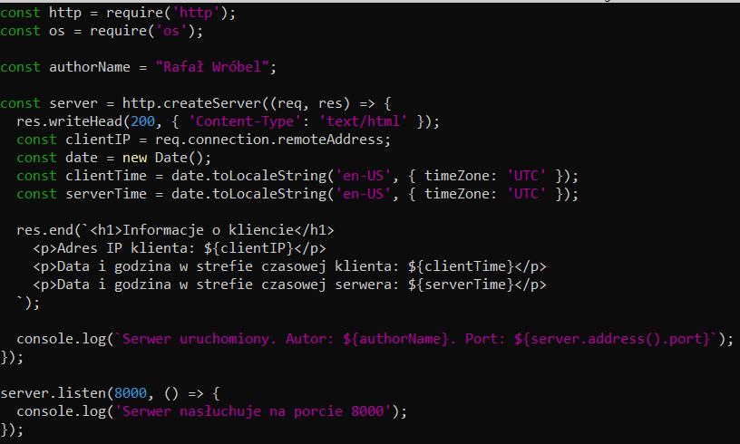
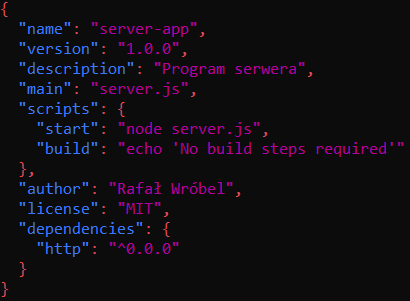
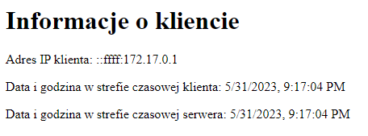
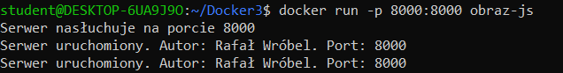
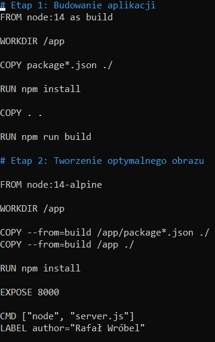

# **Sprawozdanie 1 - Rafał Wróbel**
Rozwiązania zadań do sprawozdania 1  
Link do obrazu kontenera: 

## **Zadanie 1**
Proszę napisać program serwera (dowolny język programowania), który realizować będzie następującą funkcjonalność:
a. po uruchomieniu kontenera, serwer pozostawia w logach informację o dacie uruchomienia, imieniu i nazwisku autora serwera (imię i nazwisko studenta) oraz porcie TCP, na którym serwer nasłuchuje na zgłoszenia klienta.
b. na podstawie adresu IP klienta łączącego się z serwerem, w przeglądarce powinna zostać wyświetlona strona informująca o adresie IP klienta i na podstawie tego adresu IP,o dacie i godzinie w jego strefie czasowej.

Zrzut ekranu przedstawiający kod do programu w języku JavaScript:  

Zrzut ekranu przedstawiający plik package.json:  

Zrzut ekranu przedstawiający efekt wyświetlanej strony:  

Zrzut ekranu konsoli z uruchomionym kontenerem:  

## **Zadanie 2**
Opracować plik Dockerfile, który pozwoli na zbudowanie obrazu kontenera realizującego funkcjonalność opisaną w punkcie 1. Przy ocenie brane będzie sposób opracowania tego pliku (wieloetapowe budowanie obrazu, ewentualne wykorzystanie warstwy scratch, optymalizacja pod kątem funkcjonowania cache-a w procesie budowania, optymalizacja pod kątem zawartości i ilości warstw, healthcheck itd ). Dockerfile powinien również zawierać informację o autorze tego pliku (ponownie imię oraz nazwisko studenta).

## **Zadanie 3**
Należy podać polecenia niezbędne do:
1. zbudowania opracowanego obrazu kontenera,
   > docker build -t obraz-js .
   >
2. uruchomienia kontenera na podstawie zbudowanego obrazu,
   >docker run -p 8000:8000 obraz-js:latest
   >
3. sposobu uzyskania informacji, które wygenerował serwer w trakcie uruchamiana kontenera (patrz: punkt 1a),
   > docker logs -f obraz-js
   >
4. sprawdzenia, ile warstw posiada zbudowany obraz.
   > docker history obraz-js
   >
